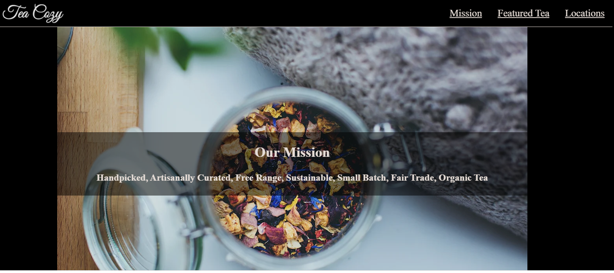

# Tea-Cozy

* **Objective** -  To create a website for TheTeaCozy.com team
* **Purpose** - Gain familiarity with HTML and CSS  
* **Link** - https://jtlabs777.github.io/Tea-Cozy
* **Description** - This was one of my earliest projects.  In this challenge, I was presented with a UI mock template of the finished site and expected to reproduce the site from scratch using my knowledge of HTML and CSS.

* **Challenges** -  Getting some elements to align vertically and horizontally in the right places was a challenge at first, but thinking through these obstacles helped me to compehend when and how to use the CSS flex value for the display property. I also learned why certain CSS flex properties belong on the parent and not  on the child and vice versa. Gaining an understanding of how margin and padding affect the box model
 was also valuable. 
 
 
