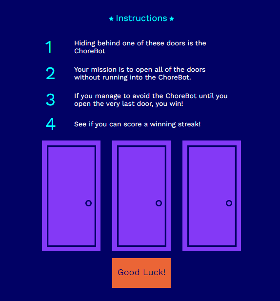

# ChoreBot  

* **Objective** - this is a guessing game, and you win by opening all the doors. You lose when you open a door the chorebot is behind (not including the last door).
* **Purpose** - To establish familiarity with CSS and HTML and JavaScript.

 * **Link** - https://jtlabs777.github.io/chorebot
  
  
  
  
*  **Lessons Learned**

This project gave me a more intuitive understanding of working with the DOM in Javascript. I used .querySelector() and .getElementbyID() to manipulate various elements. 
This also enabled me to access event handlers to engage the user in a more dynamic way. Learning and coding the algorythm that made the game work was also a treat. 

