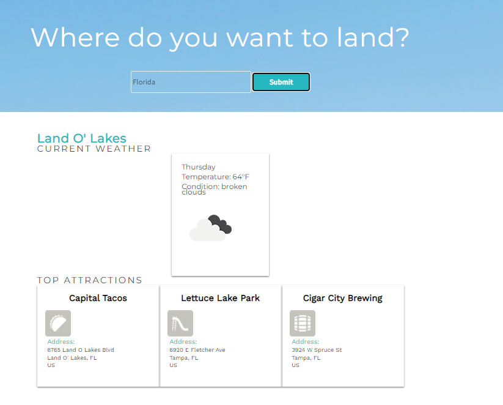

# WanderLust 

* **Objective** - To create an application that reports the local weather and lists local attractions
* **Purpose**  -  To become versed in API technology and to familiarize myself with the basic protocols
* **Prerequisites**  - required familiarity with Javascript objects, classes, Async/Await/Promises, and JSON.
* **Link** - https://jtlabs777.github.io/wanderlust/index.html

* **Description** - I learned how to connect and pull data from an API. In previous exercises I used the XLMHttpRequest object, but in this exercise I used the fetch promise--which took a shorter time to implement because it requires fewer steps than its counterpart. I learned how to read API documentation that I may pass the expected headers to the API and that I may know what properties I need to extract from the JSON. In this exercise, I worked with two API's, one from foursquare.com, the other was with openweathermap.org. Although I worked with the POST method in other API projects, I used GET exclusively for this one.

* **Challenges** - At times, I would get 403 or other type of errors that I had to sort through.  Other times, I was returning a string instead of a JSON object in my code. Once I learned the correct methods in the object the fetch promise returned, I knew how to correct those errors. Using try{} catch(){} in async functions and 'then().catch()' methods with promises allowed me to narrow down the cause of some of those problems quickly. 

